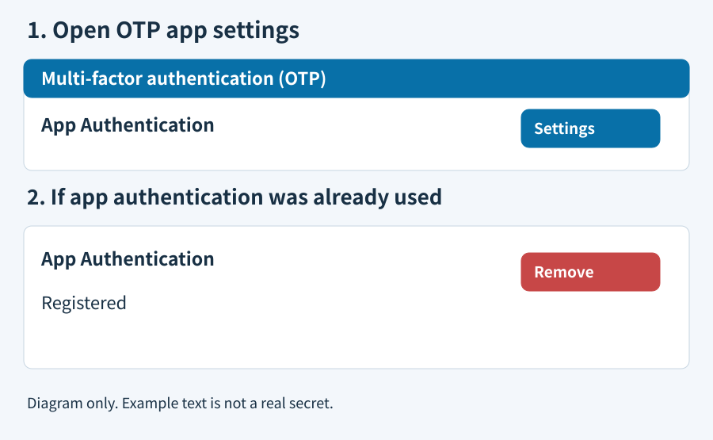
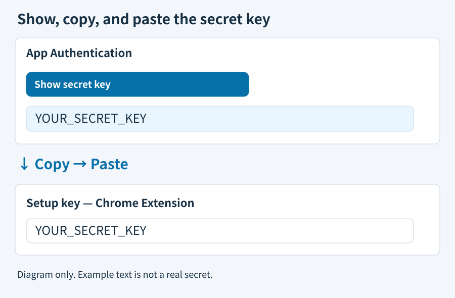
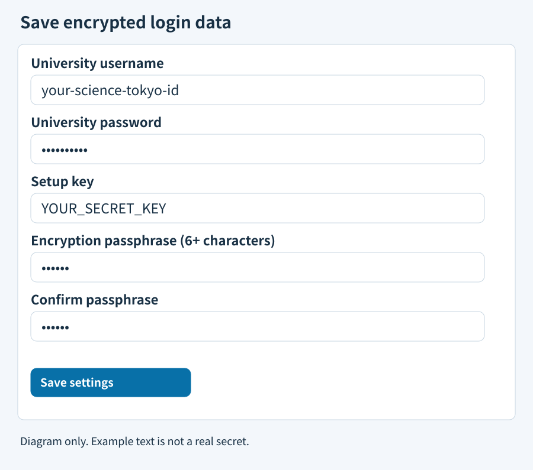

# Science Tokyo Autofill

[English](README.md) · [日本語](docs/README.ja.md) · [简体中文](docs/README.zh-CN.md)

Fills in the Science Tokyo login, including the OTP. University username and password are optional.

## Install and use

1. Download and extract the ZIP. Open `chrome://extensions`, enable Developer mode, and load the extracted folder.
2. In extension options, paste the key from the university's Show secret key into Setup key. Optionally add your university username and password, then Save.
3. Open `https://isct.ex-tic.com/auth/session`. Each step is filled in and submitted automatically, also after Chrome restarts.

## Get the setup key

In university OTP settings, open App Authentication → Settings.

Click Show secret key and copy the string into Setup key. No QR scan is needed.

Save. If the university asks for a code, enter the six-digit code shown in extension options and click Settings to finish enrollment.

If you are already enrolled, cannot show the key again, and have no valid key, click Remove and enroll again. The old key stops working.

Updating from an older version

Replace the files in your extension folder and reload it in Chrome. Enter the old passphrase once to import your settings; it is not needed after that. Leaving the setup key or password blank when saving keeps the saved value.

Saved data

Settings are encrypted, but the encryption key is stored in the same Chrome profile, so anyone who can read the whole profile can decrypt them. Do not use on shared computers. The setup key never leaves the browser; only your login details and the OTP are sent to the university. Remove saved data in options to delete everything.

## Development

`node --test test/core.test.js test/vault.test.js`

`CHROME_BIN=/path/to/chrome-for-testing node test/browser-smoke.mjs`

Browser tests use synthetic forms. The user confirmed live OTP; live username/password acceptance remains unverified.
