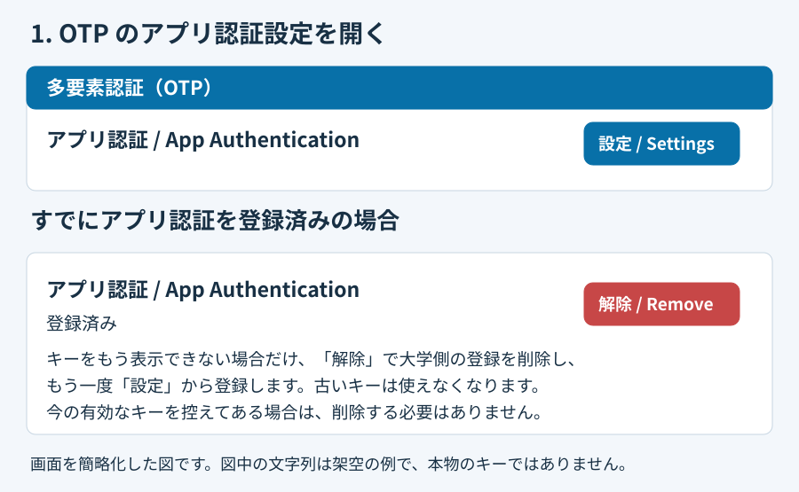
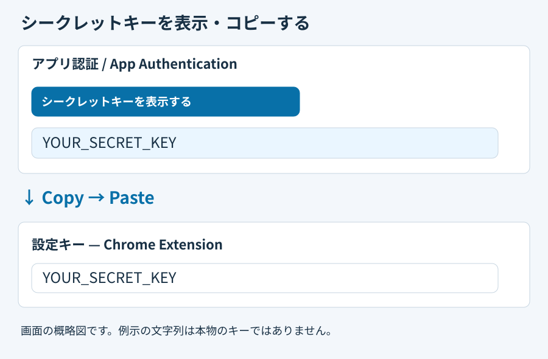
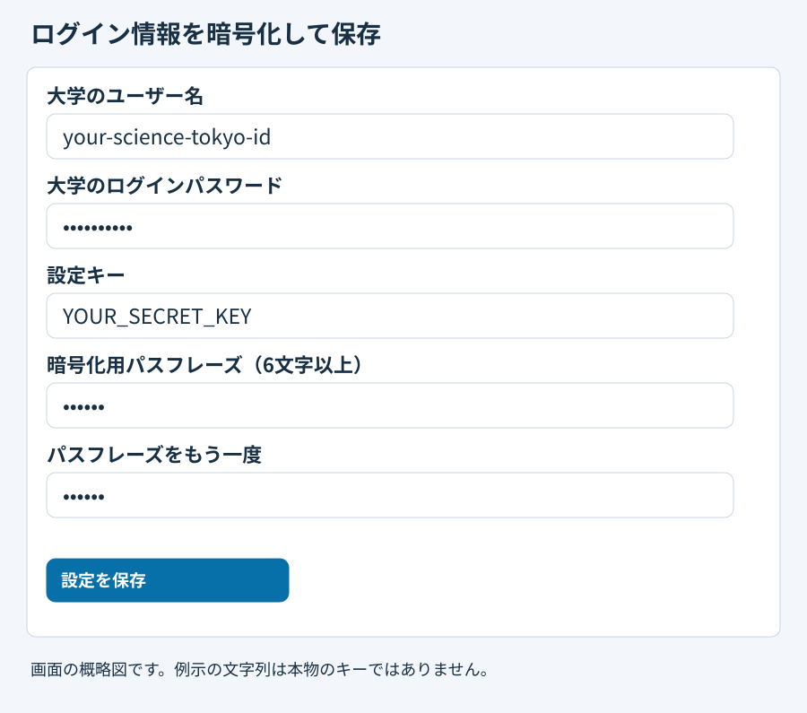

# Science Tokyo OTP Autofill

[English](../README.md) · [日本語](README.ja.md) · [简体中文](README.zh-CN.md)

Science Tokyo のログインを自動化する Chrome 拡張機能です。**自分のアカウント**のログインにだけ使ってください。

- `https://isct.ex-tic.com/auth/session/second_factor`（二段階認証の画面）では、「OTP (App) Authentication」を選び、保存した設定キーから6桁のコード（TOTP）をこのパソコンの中で作って、入力・送信します。
- 大学のユーザー名とログインパスワードも保存しておくと（任意）、`https://isct.ex-tic.com/auth/session` から「ユーザー名 → パスワード → OTP」の順に、自動で入力・送信します。
- 自動入力が動くのは、拡張機能のロックを解除している間だけです。

## この説明で使う言葉

- **大学のログインパスワード**：Science Tokyo ID で大学のシステムにログインするときのパスワードです。
- **設定キー**：大学の OTP 設定画面で「シークレットキー（Show secret key）」として表示される文字列です。この拡張機能は、このキーから6桁のコードを作ります。ログインのたびに変わる6桁のコードとは別のもので、最初に一度登録すれば、毎回新しく発行する必要はありません。大学の画面に「手動入力用のキー」が表示される場合は、それも同じものです。なお、この拡張機能はスマートフォンの Google Authenticator などからコードを読み取ることはできません。
- **暗号化用パスフレーズ**：この拡張機能に保存するデータを暗号化するために、自分で決める合言葉（この拡張機能専用のパスワード）です。大学のログインパスワードとは別のものにしてください。6文字以上が必要ですが、6文字は最低限の条件で、6文字あれば安全という意味ではありません。長いものほど推測されにくくなります。
- **ロックとロック解除**：保存したデータは、普段は暗号化されたまま（ロック中）です。暗号化用パスフレーズを入力してロックを解除すると、30分間だけ自動入力が使えます。

## インストール

1. このリポジトリをダウンロードします。ZIP でダウンロードした場合は展開します。
2. Chrome で `chrome://extensions` を開き、「デベロッパー モード」をオンにします。
3. 「パッケージ化されていない拡張機能を読み込む」を押し、ダウンロードしたフォルダを選びます。
4. 拡張機能の「詳細」→「拡張機能のオプション」を押して、設定画面を開きます。ツールバーにあるこの拡張機能のアイコンを押しても開けます。設定画面が英語で表示された場合は、上部の「日本語」を押してください。

更新版を入れたときは、`chrome://extensions` でこの拡張機能を再読み込みしてください。再読み込みすると、拡張機能はロックされます。

## 初めての設定（OTP のアプリ認証）

[画像付きの設定ガイド](../help.ja.html) · [大学の公式ガイド](https://www.helpdesk.cii.isct.ac.jp/st/helpdesk/science-tokyo/login_guide.html)

QR コードの読み取りや、Google Authenticator などのスマートフォンの認証アプリへの登録は必要ありません。

### 1. OTP のアプリ認証設定を開く

大学の認証ポータルで「多要素認証（OTP）」を開きます。「アプリ認証 / App Authentication」の行にある「設定 / Settings」を押します。

すでにアプリ認証を登録済みの場合は、先に「[すでにアプリ認証を登録済みの場合](#すでにアプリ認証を登録済みの場合)」を読んでください。



### 2. シークレットキーを表示してコピーする

1. 「シークレットキーを表示する / Show secret key」を押します。
2. 表示された文字列をコピーします。
3. 拡張機能の設定画面を開き、「設定キー」欄に貼り付けます。

`otpauth://totp` で始まるリンクを持っている場合は、それを貼り付けても使えます。設定キーは他人に見せないでください。GitHub やチャットにも貼らないでください。



### 3. ログイン情報と設定キーを暗号化して保存する

1. ユーザー名とパスワードも自動入力したい場合は、「大学のユーザー名（Science Tokyo ID）」と「大学のログインパスワード」を入力します。OTP だけを自動入力したい場合は、空欄のままで構いません。
2. 暗号化用パスフレーズを決めて、「暗号化用パスフレーズ（6文字以上）」と「暗号化用パスフレーズ（確認のためもう一度）」に同じものを入力します。
3. ページ最下部の「設定を保存」を押します。入力した内容が、まとめて暗号化されて保存されます。保存したあと30分間は、ロックが解除された状態です。



### 4. 大学側の登録を完了する

大学の画面で6桁のコードを求められたら、次の順に操作して登録を完了します。

1. 拡張機能の設定画面で「現在のコードを表示」を押します。
2. 表示された6桁のコードを、大学の画面の「トークン」欄に入力します。
3. 大学の画面で「設定 / Settings」を押します。

拡張機能に保存する設定キーは、大学側で現在有効になっているキーと同じものにしてください。

### すでにアプリ認証を登録済みの場合

以前に表示したシークレットキーを控えてあり、それが今も有効なら、そのキーを「設定キー」欄に貼り付ければ使えます。登録を削除したり、キーを発行し直したりする必要はありません。

**シークレットキーをもう表示できない場合は、一度登録を削除して、新しいキーを発行し直す必要があります。**

1. 「多要素認証（OTP）」の画面で、「アプリ認証 / App Authentication」の「解除（Remove）」を押して、大学側の登録を削除します。この「解除」は登録の削除で、拡張機能の「ロック解除」とは別の操作です。
2. もう一度「設定 / Settings」を押し、手順2から登録し直します。
3. 新しく表示されたキーを拡張機能に貼り付けて保存し、手順4で大学側の登録も完了します。

**登録を削除すると、以前のキーは使えなくなります。**

図はいずれも画面を簡略化したものです。図中の文字列は架空の例で、本物のキーではありません。

## 毎回の使い方

1. Chrome を起動したら、拡張機能の設定画面を開きます。
2. 「暗号化用パスフレーズ（ロック解除・設定キーの表示に使用）」に暗号化用パスフレーズを入力し、「30分間ロックを解除」を押します。
3. `https://isct.ex-tic.com/auth/session` を開くか、再読み込みします。

ユーザー名、パスワード、OTP の順に、自動で入力して送信します。OTP の画面では「OTP (App) Authentication」を自動で選び、新しいコードを入力します。

- 大学のユーザー名とログインパスワードを保存していない場合は、ログイン画面で自分で入力してください。OTP の画面は自動で入力します。
- 二段階認証の画面（`https://isct.ex-tic.com/auth/session/second_factor`）を直接開いた場合は、OTP だけを自動で入力します。
- すでに自分で入力を始めている場合や、別の認証方式を選んでいる場合は、自動送信しません。そのまま自分で操作を続けてください。

### 自動でロックされるとき

次のときは自動でロックされます。すぐにロックしたいときは「今すぐロック」を押します。

- ロックを解除してから30分たったとき
- Chrome を再起動したとき
- 拡張機能を再読み込みしたとき、または無効にしたとき

## 設定を変更するとき

### ログイン情報を追加する、または暗号化用パスフレーズを変更する

1. 暗号化用パスフレーズを入力し、「30分間ロックを解除」を押します。
2. 「設定キー」欄は空欄のままにします。
3. ログイン情報を追加する場合は、「大学のユーザー名（Science Tokyo ID）」と「大学のログインパスワード」を入力します。変更しない欄は空欄のままで構いません。ロック解除中に空欄のまま保存した欄は、保存済みの内容をそのまま使います。
4. 暗号化用パスフレーズの2つの欄に、今のものか新しいものを入力します。新しいものを入力すると、暗号化用パスフレーズが変わります。
5. 「設定を保存」を押します。

ロック中に新しい設定キーを入力して保存すると、保存済みのユーザー名とパスワードは引き継がれません。引き継ぎたい場合は、先にロックを解除してください。

### 保存した設定キーを確認する

暗号化用パスフレーズを入力して、「保存した設定キーを30秒間表示」を押します。30秒たつか、設定画面のタブから離れると、自動で隠れます。

### 暗号化用パスフレーズを忘れた場合

暗号化用パスフレーズはどこにも保存しないため、復元できません。設定キーとログイン情報を入力し直して、新しい暗号化用パスフレーズで保存してください。元の設定キーが手元にない場合は、大学側で設定キーを登録し直す必要があります（「[すでにアプリ認証を登録済みの場合](#すでにアプリ認証を登録済みの場合)」を参照）。

## バージョン0.2から更新した場合

バージョン0.2では、設定キーを暗号化せずに保存していました。この古いキーは、そのままでは自動入力に使いません。次の手順で暗号化してください。

1. 「設定キー」欄を空欄のままにします。
2. 新しい暗号化用パスフレーズを決めて、2つの欄に入力します。
3. 「設定を保存」を押します。

暗号化して保存できたあとで、暗号化されていない古い保存項目を削除します。

## 個人情報とセキュリティ

### 保存と送信

- このリポジトリには、大学のログイン情報や設定キーは含まれていません。
- 大学のユーザー名、大学のログインパスワード、設定キーは、Web Crypto の **AES-256-GCM** で暗号化して保存します。保存するたびに、ランダムな16バイトのソルトと12バイトの nonce を作ります。暗号鍵は、暗号化用パスフレーズから **PBKDF2-SHA256（60万回）** で作ります。
- このパソコンの `chrome.storage.local` にずっと保存するのは、暗号化したデータと、秘密ではない暗号化の設定値だけです。暗号化用パスフレーズと、そこから作った暗号鍵は保存しません。
- [Chrome の拡張機能の保存領域は、それ自体では暗号化されません](https://developer.chrome.com/docs/extensions/develop/security-privacy/user-privacy)。そのため、この拡張機能は保存する前に自分で暗号化しています。
- ロックを解除している間は、復号したログイン情報と設定キーを、[メモリ上にだけ置かれる `chrome.storage.session`](https://developer.chrome.com/docs/extensions/reference/api/storage#property-session) に置きます。
- どちらの保存領域も、拡張機能の中の信頼できる部分だけが読めるように制限しています。大学のログイン画面が受け取れるのはユーザー名とパスワードだけで、二段階認証の画面が受け取れるのは6桁のコードだけです。
- 他の端末との同期や、外部へのアップロードはしません。大学の HTTPS のフォームへ送るのは、ユーザー名と大学のログインパスワード（ログイン画面）、生成した6桁のコード（二段階認証の画面）だけです。設定キーと暗号化用パスフレーズは送信しません。
- コードの生成、ロック解除、設定キーやコードの表示では、通信をしません。

### データの削除

- ブラウザの閲覧履歴やキャッシュを削除しても、保存したデータは消えません。
- 「保存したデータを削除」を押すか、拡張機能をアンインストールすると、現在保存されている項目は削除されます。
- ただし、ディスク上に残った古い断片や、バックアップに含まれるコピー（バージョン0.2で暗号化せずに保存したキーを含む）を、復元できないように消すことはできません。気になる場合は、暗号化への移行後に、大学側で新しい設定キーを登録し直してください。

### 守れないこと

- ロック中の保存データを盗まれた場合に、どこまで守れるかは暗号化用パスフレーズの強さで決まります。
- ロックを解除している間や、設定キーを表示・使用している間に、マルウェア、拡張機能の改ざん、ブラウザの乗っ取り、キーロガーなどがあると、情報を盗まれるおそれがあります。この拡張機能では防げません。
- 大学のログイン画面を攻撃者に乗っ取られた場合も、ログイン情報や6桁のコードを盗まれるおそれがあります。
- ログインする端末に設定キーを保存して自動入力すると、スマートフォンなど別の端末を使う場合に比べて、二段階認証の効果が弱くなります。自分のアカウントで、信頼できる端末だけで使ってください。
- 第三者による独立したセキュリティ監査は受けていません。

## 動作確認の状況

- OTP の自動入力は、利用者が実際の大学のログインで動くことを確認しています。
- ユーザー名とパスワードの自動入力は、公開されているログイン画面をもとに再現した模擬フォームで確認しました。実際の大学のサーバーで受け付けられるかは、まだ確認していません。
- 認証画面の HTML をもとに、実際のフォームと入力欄の ID を使った模擬ページを作り、架空のトークンで、認証方式の選択と正しいフォームの送信をブラウザで確認しています。
- 大学のサイトの HTML が変わった場合は、`login_script.js` や `content_script.js` の修正が必要になることがあります。

## 開発者向けのテスト

リポジトリのルートで、次のコマンドを実行します。

```sh
node --test test/core.test.js test/vault.test.js
```

ブラウザでのテストには、Chrome for Testing または Chromium が必要です。架空のアカウントとトークンだけを使い、ユーザー名 → パスワード → OTP の流れ、暗号化、ロック解除と自動ロック、言語の切り替えを確認します。

```sh
CHROME_BIN=/path/to/chrome-for-testing node test/browser-smoke.mjs
```
