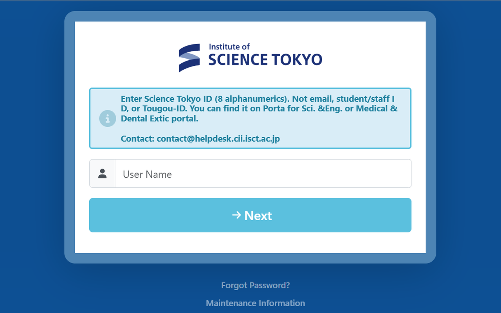
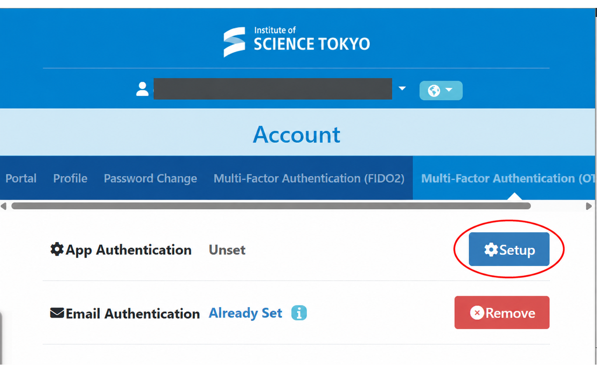
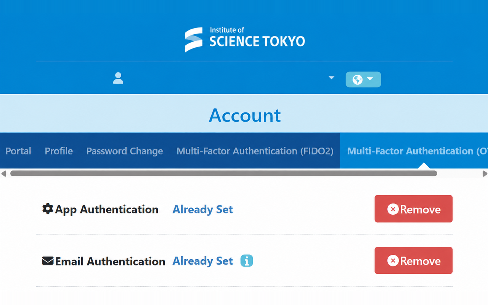
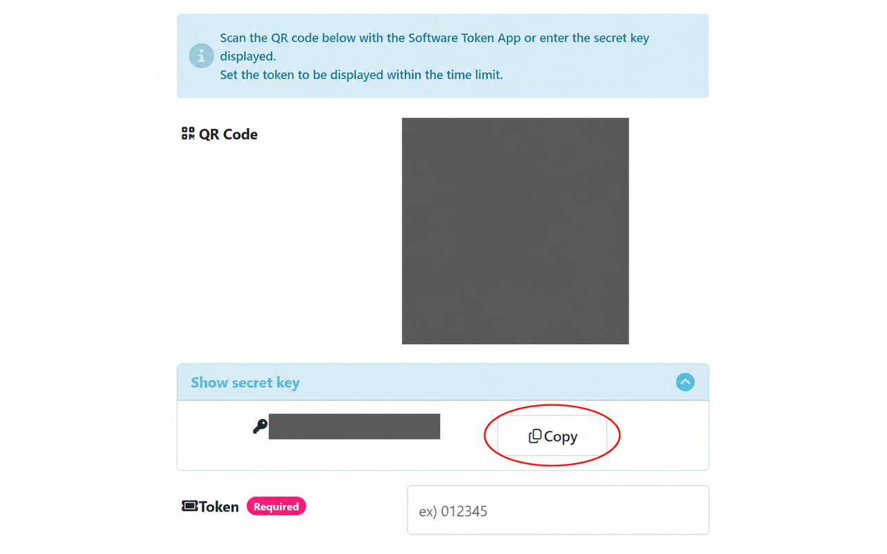

# Science Tokyo Autofill

[English](../README.md) · [日本語](README.ja.md) · [简体中文](README.zh-CN.md)

Science Tokyo のログインをOTPまで自動入力します。入力した項目だけでも保存でき、残りはあとから追加できます。

[最新版のZIPをダウンロード（v0.7.0）](https://github.com/Mr-Sakasu/isct-otp-extension/releases/download/v0.7.0/science-tokyo-autofill-v0.7.0.zip)

## インストールと使い方

1. ZIPをダウンロードして展開します。`chrome://extensions` でデベロッパーモードをオンにし、展開したフォルダを読み込みます。
2. 下の手順で設定キーを取得し、拡張機能の「設定キー」欄に貼り付けて「保存」します。必要なら大学のユーザー名とパスワードも保存します。
3. [大学のログイン画面](https://isct.ex-tic.com/auth/session)を開きます。保存したログイン情報とOTPを自動で入力・送信します。ユーザー名とパスワードを保存していない場合は、手動で入力します。Chromeを再起動してもそのまま使えます。

## 設定キーの取得

### 1. アプリ認証の設定を開く

大学の「多要素認証（OTP） / Multi-Factor Authentication (OTP)」を開きます。利用状況に合わせて、次のどちらかの手順で進めます。

#### 初めて利用する人

「アプリ認証 / App Authentication」が「未設定 / Unset」なら、「設定 / Setup」を押します。その後、下の「2. 設定キーをコピーする」に進みます。

#### 既にLMSにログインしたことがある人

「アプリ認証」が「設定済み / Already Set」で、キーを再表示できず、有効なキーも手元にない場合は、次の手順で取得し直します。

1. **アプリ認証の行**の「解除 / Remove」を押します。
2. 「設定 / Setup」を押し、下の「2. 設定キーをコピーする」に進みます。

「解除」すると古いキーは使えなくなります。以前のキーを登録した認証アプリも、新しいキーで登録し直してください。

LMSを利用したことがあっても、アプリ認証が「未設定 / Unset」なら、上の「初めて利用する人」と同じ手順で進めます。

有効な設定キーを持っている場合は、そのキーを使って「3. 拡張機能に保存する」に進みます。

### 2. 設定キーをコピーする

「シークレットキーを表示する / Show secret key」を開き、「コピー / Copy」を押します。拡張機能の「設定キー」欄に貼り付けます。QRコードの読み取りは不要です。

### 3. 拡張機能に保存する

必要なら大学のユーザー名とログインパスワードも入れて「保存」を押します。大学の登録画面でコードを求められたら、拡張機能の設定画面に出る6桁を入力し、大学側の「設定」を押すと登録完了です。

入力した項目だけでも保存できます。空欄の項目は、保存済みの内容を使います。「保存データの確認・削除」を開いて「保存した内容を表示」を押すと、ユーザー名・パスワード・設定キーを確認できます。もう一度押すと隠れます。

画面画像の個人情報・QRコード・設定キーは伏せてあります。拡張機能の設定図は架空の例です。

旧版からの更新

上のZIPを展開し、現在の拡張機能フォルダ内のファイルを置き換えます。`chrome://extensions` でこの拡張機能の再読み込みボタンを押すと更新完了です。保存済みの設定はそのまま使えます。

以前のパスフレーズを求められた場合は、一度入力すると設定を引き継げます。以後パスフレーズは不要です。

保存データ

設定は暗号化して保存しますが、暗号鍵も同じChromeプロファイル内にあります。プロファイル全体を読み取られると復号できます。共用のパソコンでは使わないでください。設定キーは外部へ送信しません。大学へ送るのは、設定したログイン情報とOTPだけです。設定画面の「保存データを削除」ですべて消せます。

## 開発

`node --test test/core.test.js test/vault.test.js`

`CHROME_BIN=/path/to/chrome-for-testing node test/browser-smoke.mjs`

ブラウザテストは模擬フォームを使います。実際のOTP入力は利用者が確認済みです。ユーザー名・パスワードの実環境での動作は未確認です。
