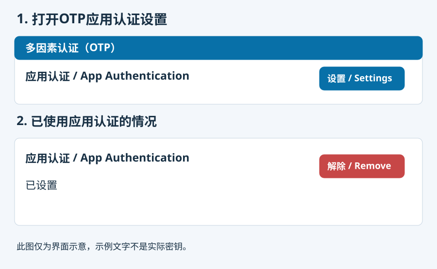
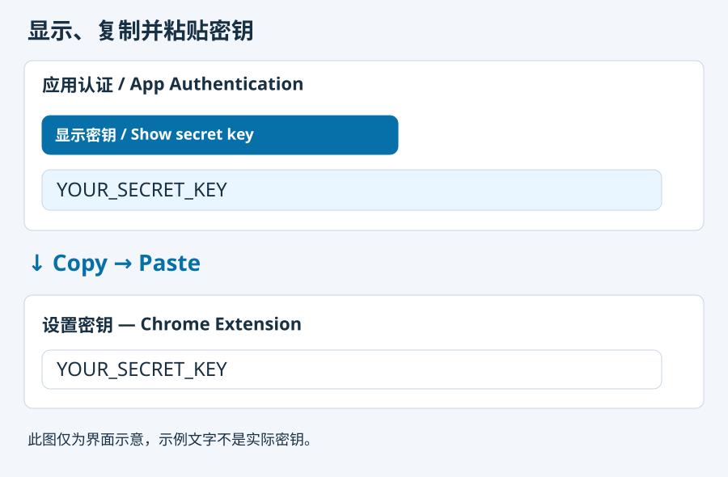
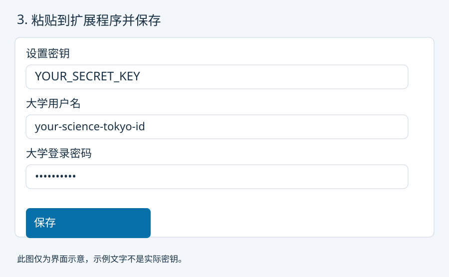

# Science Tokyo Autofill

[English](../README.md) · [日本語](README.ja.md) · [简体中文](README.zh-CN.md)

自动填写 Science Tokyo 登录信息，包括 OTP。大学用户名和密码可选保存。

## 安装与使用

1. 下载并解压 ZIP。打开 `chrome://extensions`，开启开发者模式，加载解压后的文件夹。
2. 在扩展程序设置中，将大学“显示密钥 / Show secret key”显示的字符串粘贴到“设置密钥”栏。如需要，再填写用户名和密码，然后点击“保存”。
3. 打开 `https://isct.ex-tic.com/auth/session`，各步骤会自动填写并提交。重启 Chrome 后也可直接使用。

## 获取设置密钥

在大学 OTP 设置中，打开“应用认证 / App Authentication”的“设置 / Settings”。

复制“显示密钥 / Show secret key”显示的字符串，粘贴到“设置密钥”栏。无需扫描二维码。

点击“保存”。大学页面要求输入验证码时，输入设置页面显示的6位数字并点击“设置”，即完成注册。

仅在已注册、无法再次显示密钥且手头没有有效密钥时，点击“解除 / Remove”后重新注册。旧密钥将失效。

从旧版更新

替换扩展程序文件夹中的文件，并在 Chrome 中重新加载。输入一次旧版口令即可导入设置，之后不再需要口令。保存时设置密钥或密码留空，则保留已保存的值。

保存的数据

设置经过加密，但加密密钥也保存在同一个 Chrome 配置文件中，能读取整个配置文件的人即可解密。请勿在公用电脑上使用。设置密钥不会发送到外部；发送给大学的只有您设置的登录信息和 OTP。在设置页面点击“删除保存的数据”即可全部删除。

## 开发

`node --test test/core.test.js test/vault.test.js`

`CHROME_BIN=/path/to/chrome-for-testing node test/browser-smoke.mjs`

浏览器测试使用模拟表单。用户已确认实际 OTP 可用；用户名和密码在实际环境中的表现尚未验证。
